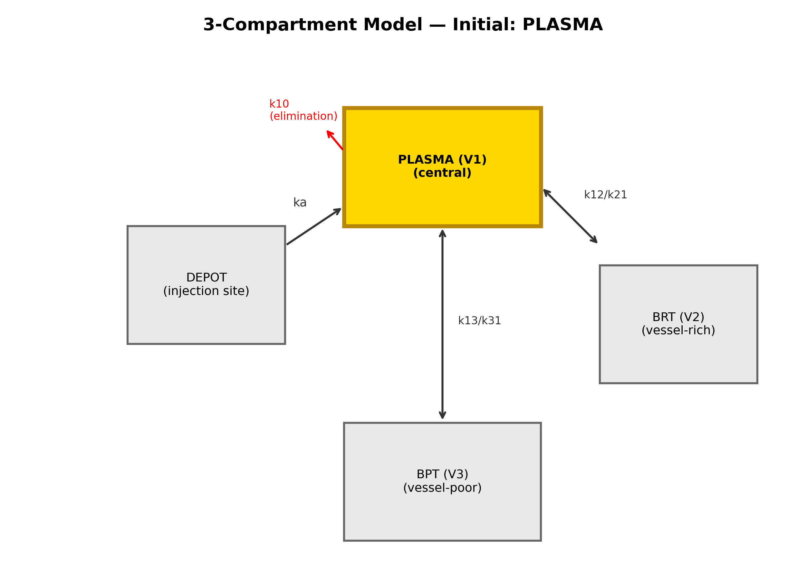
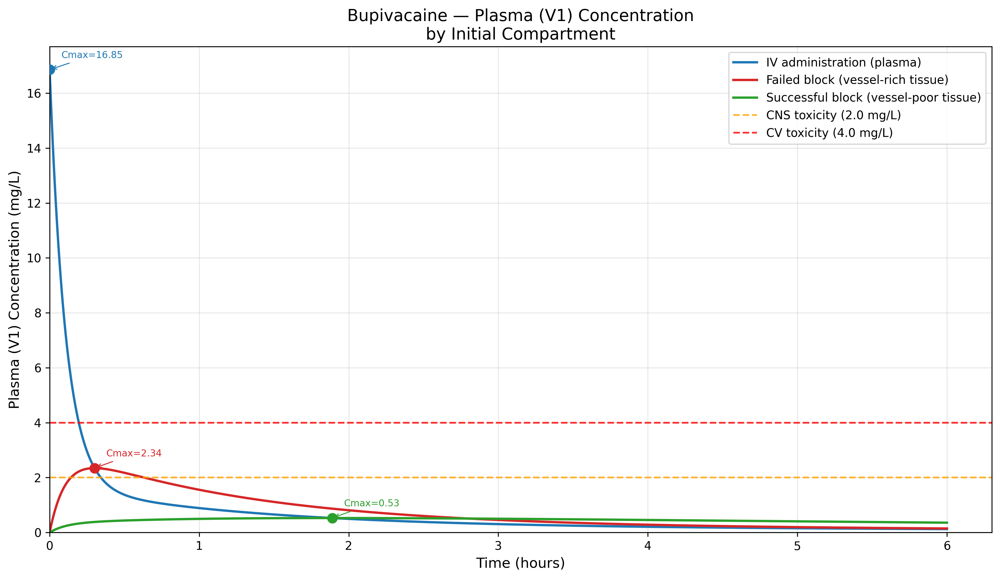
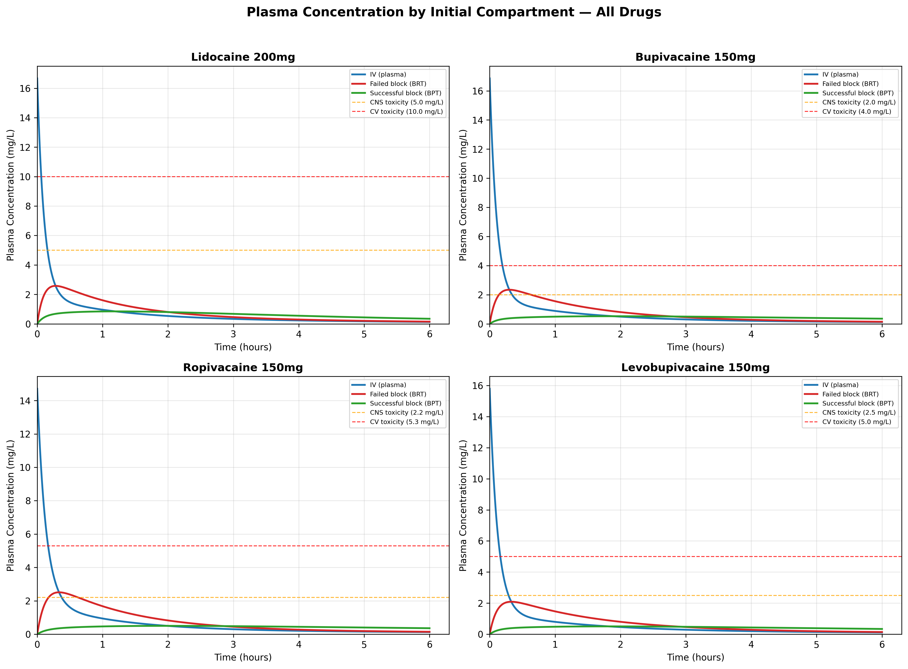
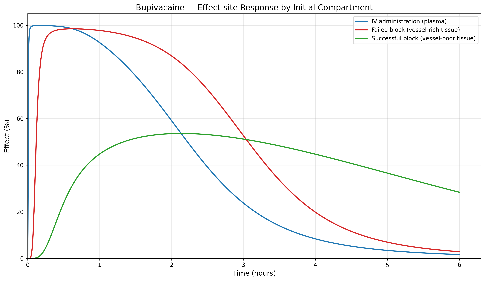
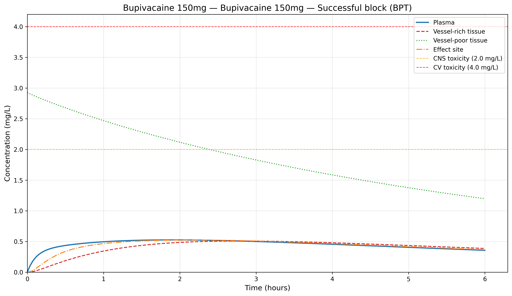
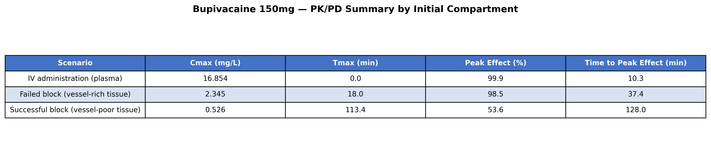

# Highlights

- First open-source PKPD simulator with selectable initial compartment for local anesthetics
- Simulates clinically distinct scenarios: successful block, failed block, IV, and depot
- Supports context-sensitive maximum dose framework for regional anesthesia safety
- Built-in parameters for lidocaine, bupivacaine, ropivacaine, and levobupivacaine
- Demonstrates route-adaptive PKPD integration feasibility for anesthesia information systems

# Abstract

yoshika (Yielding Open Simulation of Hybrid Inter-disciplinary Kinetic Absorption)
is an open-source Python package for pharmacokinetic-pharmacodynamic (PKPD) simulation
of local anesthetics with a selectable initial compartment. Traditional three-compartment
pharmacokinetic models assume intravenous administration where drug enters the central
plasma compartment first. In regional anesthesia, however, drug is deposited directly into
tissues: a successful peripheral nerve block deposits drug into vessel-poor tissue, while a
failed block may deposit drug into vessel-rich tissue or directly into plasma. yoshika enables
researchers and clinicians to simulate these clinically distinct scenarios by selecting the
initial compartment of drug deposition and comparing the resulting concentration-time profiles
and pharmacodynamic effects. The package includes built-in parameters for four local
anesthetics (lidocaine, bupivacaine, ropivacaine, levobupivacaine), an effect-site compartment
with sigmoid Emax pharmacodynamic model, and visualization utilities. By quantifying how the
initial compartment determines peak plasma concentration and time-to-toxicity, yoshika supports
the concept of context-sensitive maximum dose recommendations and route-adaptive PKPD simulation
in anesthesia information management systems.

**Keywords:** pharmacokinetics; pharmacodynamics; local anesthetics; regional anesthesia;
compartment model; simulation; Python; systemic toxicity

# 1. Introduction

## 1.1. The initial compartment problem in regional anesthesia

In regional anesthesia and pain medicine, local anesthetics (LAs) are injected near nerves and
fascial planes rather than intravenously. The pharmacokinetic behavior of these drugs
depends critically on the injection site and block success. Existing PK simulation tools
(e.g., STANPUMP, Tivatrainer, Eleveld models) uniformly assume intravenous administration,
where drug enters the central (plasma) compartment at time zero [@eleveld2018]. This
assumption does not hold for regional anesthesia, where:

- A successful peripheral nerve block deposits the drug bolus into vessel-poor tissue
  (V3/BPT), resulting in slow absorption into plasma with a delayed, attenuated peak
  plasma concentration.
- A failed block with intravascular injection deposits the drug into vessel-rich tissue
  (V2/BRT) or directly into plasma, resulting in rapid systemic exposure and potentially
  toxic concentrations.
- Fascial plane blocks and depot injections involve absorption through a depot compartment
  with first-order absorption kinetics ($k_a$).

To our knowledge, no existing open-source PKPD simulation package explicitly supports
selectable initial compartment for local anesthetics.

## 1.2. Physicochemical basis of compartmental drug distribution

The pharmacokinetic behavior of LAs across tissue compartments is fundamentally governed by
their physicochemical properties, particularly lipophilicity and ionization state. Strichartz
et al. systematically measured octanol/buffer partition coefficients and pKa values for
clinically used LAs, demonstrating that lipophilicity---as quantified by the partition
coefficient---and temperature-dependent ionization are primary determinants of tissue
distribution and nerve-blocking potency [@strichartz1990]. Their finding that the protonated
species concentration in lipid remains nearly constant upon cooling, while the neutral species
concentration decreases substantially, provided a physicochemical explanation for the increased
blocking potency of LAs at lower temperatures.

Building on these fundamental properties, Kavčič et al. applied quantum chemical calculations
to model the transfer energetics of seven LAs from extracellular fluid across the biological
membrane to the axoplasm, demonstrating that LA transfer between compartments relies on pH
differences and affinities toward lipophilic compartments [@kavcic2021]. Their computational
analysis showed that LAs are stored in Schwann cell membranes, adipose tissue, and other
lipophilic compartments, from which they are slowly released---a process directly relevant
to the vessel-poor tissue (BPT) compartment in pharmacokinetic models. Furthermore, local
acidosis reduces LA storage in lipophilic compartments, decreasing the duration of action,
while more lipophilic LAs (e.g., bupivacaine) exhibit greater storage capacity and longer
duration.

These physicochemical principles provide the theoretical foundation for the compartmental
modeling approach implemented in yoshika: the initial compartment of drug deposition
determines the subsequent absorption kinetics because tissue-specific lipophilicity and pH
govern the rate of drug transfer between compartments.

## 1.3. Clinical significance: systemic toxicity risk and context-sensitive dosing

The clinical significance of selectable initial compartment modeling lies in its
direct implications for local anesthetic systemic toxicity (LAST) risk assessment.
Traditional maximum recommended doses for LAs (e.g., bupivacaine
2 mg/kg, lidocaine 4.5 mg/kg without epinephrine) are derived from intravenous
pharmacokinetic studies, where the entire dose enters the central plasma compartment
instantaneously [@rosenberg2004; @decassai2025]. This assumption produces the
highest possible peak plasma concentration (Cmax) for a given dose.

However, in regional anesthesia, the initial compartment of drug deposition
fundamentally alters the concentration-time profile:

- **Successful block (BPT start):** Drug deposited in vessel-poor tissue is
  absorbed slowly into plasma, producing a delayed and attenuated Cmax. The
  block is effective, the duration is long, and systemic exposure is low.
- **Failed block (BRT start):** Drug deposited near vessel-rich tissue is
  absorbed rapidly, producing an earlier and higher Cmax. The block effect is
  short, and systemic exposure approaches IV-like kinetics.
- **Intravascular injection (Plasma start):** Equivalent to IV bolus with
  immediate high Cmax and maximum toxicity risk.

Importantly, "successful/vessel-poor/long-duration/slow-removal" and
"failed/vessel-rich/short-duration/rapid-removal" are pharmacokinetically
synonymous descriptions without positive or negative connotations---they
represent neutral descriptions of drug disposition based on the anatomical
site of deposition.

We propose the concept of *context-sensitive maximum dose* for LAs, analogous
to the context-sensitive half-time that transformed understanding of intravenous
drug offset [@hughes1992]. Under this framework, the effective maximum safe dose
is not a single fixed value but varies with the clinical scenario (Table 1).

: Proposed context-sensitive maximum dose framework. \label{tab:context_dose}

| Scenario | Initial Compartment | Expected Cmax | Dose Implication |
|:---------|:-------------------|:-------------|:-----------------|
| Successful block | BPT (V3) | Low, delayed | Higher dose may be safe |
| Partial block | Mixed (BPT + BRT) | Intermediate | Standard limit applies |
| Failed block | BRT (V2) | Moderate-high, early | Lower dose may be needed |
| Intravascular injection | Plasma (V1) | Very high, immediate | Traditional IV limits apply |
| Epidural | Depot (multi-pathway) | Intermediate, delayed | Depot model approximation |

This framework provides a pharmacokinetic rationale for the empirical observation
that LAST is rare despite frequent exceeding of traditional mg/kg dose limits in
regional anesthesia practice [@rosenberg2004]. When the block is successful, the
drug is sequestered in vessel-poor tissue with slow systemic release---precisely
the scenario where doses above traditional limits are routinely administered safely.

## 1.4. Existing anesthesia simulators and positioning of yoshika

Several open-source anesthesia simulation tools exist, but none address the specific
problem of initial compartment selection for local anesthetics in regional anesthesia.

The Python Anesthesia Simulator (PAS) [@aubouin2023] provides a general framework for
simulating the effects of propofol, remifentanil, and norepinephrine during total
intravenous anesthesia (TIVA). PAS is designed as a benchmark for the control community
to design multidrug controllers, with pharmacokinetic models (Schnider, Marsh, Eleveld)
that uniformly assume central compartment input.

The Anesthesia Response Simulator (AReS) [@hosseinirad2025] extends TIVA simulation
to propofol, remifentanil, norepinephrine, and rocuronium, with target-controlled
infusion modules and surgical stimulus profiles. AReS is available in both Python
and MATLAB and focuses on automated anesthesia control testing.

The AMICAS simulator [@ionescu2021] provides a MATLAB/Simulink-based patient
simulator for multi-drug dosing control during general anesthesia, incorporating
complex synergistic and antagonistic interactions between hypnosis, analgesia, and
hemodynamic variables.

All three simulators focus exclusively on intravenous general anesthetics and assume
drug administration into the central (plasma) compartment. None addresses local
anesthetics or the problem of route-dependent initial compartment selection that is
central to regional anesthesia pharmacokinetics. yoshika fills this gap by providing
a simulation tool specifically designed for local anesthetics with selectable initial
compartment.

## 1.5. Aim

The aim of this study is to present yoshika, an open-source Python package for
PKPD simulation of local anesthetics with selectable initial compartment, and to
demonstrate how the choice of initial compartment affects predicted plasma
concentration profiles and toxicity risk across clinically relevant scenarios.

# 2. Methods

## 2.1. Software architecture

yoshika is structured as a modular Python package with the following components:

- **compartments**: Compartment definitions (`PLASMA`, `BRT`, `BPT`, `DEPOT`) and initial condition logic.
- **drugs**: Drug parameter database with four built-in local anesthetics (lidocaine, bupivacaine, ropivacaine, levobupivacaine) and custom drug support.
- **model**: Three-compartment PK ODE model solved with SciPy's `solve_ivp` (RK45 method) [@virtanen2020].
- **pd**: Pharmacodynamic models (Emax, sigmoid Emax, effect-site equilibration).
- **simulator**: High-level API for single simulations and multi-scenario comparison.
- **plotting**: Matplotlib-based visualization utilities for concentration-time curves, effect profiles, and comparison plots.
- **utils**: Utility functions for AUC calculation, half-life estimation, and unit conversion.

The package follows a clean separation of concerns: the PK model (ODE system) is independent of the PD model, and both are independent of the drug parameter database. This design allows users to substitute custom drug parameters, modify the PD model, or extend the compartment structure without affecting other components.

## 2.2. Pharmacokinetic model

yoshika implements a standard three-compartment mammillary PK model with an optional depot
compartment. The system of ordinary differential equations (ODEs) is:

$$\frac{dA_{depot}}{dt} = -k_a \cdot A_{depot}$$

$$\frac{dA_1}{dt} = k_a \cdot A_{depot} - (k_{10} + k_{12} + k_{13}) \cdot A_1 + k_{21} \cdot A_2 + k_{31} \cdot A_3$$

$$\frac{dA_2}{dt} = k_{12} \cdot A_1 - k_{21} \cdot A_2$$

$$\frac{dA_3}{dt} = k_{13} \cdot A_1 - k_{31} \cdot A_3$$

where $A_1$, $A_2$, $A_3$ are drug amounts in plasma (V1), vessel-rich tissue (V2/BRT), and
vessel-poor tissue (V3/BPT), respectively; $A_{depot}$ is the amount in the depot compartment;
$k_{10}$ is the elimination rate constant; $k_{12}$, $k_{21}$, $k_{13}$, $k_{31}$ are
intercompartmental transfer rate constants; and $k_a$ is the absorption rate constant from the depot.

The initial conditions are set according to the selected compartment (Table 2):

: Initial conditions for each selectable compartment. \label{tab:initial_conditions}

| Initial Compartment       | $A_{depot}(0)$ | $A_1(0)$ | $A_2(0)$ | $A_3(0)$ |
|:--------------------------|:---------------|:---------|:---------|:---------|
| Plasma (IV)               | 0              | Dose     | 0        | 0        |
| BRT (failed block)        | 0              | 0        | Dose     | 0        |
| BPT (successful block)    | 0              | 0        | 0        | Dose     |
| Depot (fascial plane)     | Dose           | 0        | 0        | 0        |

The ODEs are solved numerically using `scipy.integrate.solve_ivp` with the RK45 method
(explicit Runge-Kutta of order 5(4), Dormand-Prince) [@virtanen2020]. Concentrations are
computed as $C_i = A_i / V_i$ at each time point.

## 2.3. Pharmacodynamic model

yoshika includes an effect-site compartment linked to the central compartment via a
first-order rate constant $k_{e0}$:

$$\frac{dC_e}{dt} = k_{e0} \cdot (C_p - C_e)$$

where $C_e$ is the effect-site concentration and $C_p$ is the plasma concentration.
The drug effect is computed using a sigmoid Emax model:

$$E = E_{max} \cdot \frac{C_e^{\gamma}}{EC_{50}^{\gamma} + C_e^{\gamma}}$$

## 2.4. Drug parameter database

The package includes pharmacokinetic parameters for four commonly used local anesthetics:
lidocaine, bupivacaine, ropivacaine, and levobupivacaine [@tucker1979; @burm1989]. Parameters
include compartment volumes ($V_1$, $V_2$, $V_3$), clearances ($CL$, $Q_2$, $Q_3$), effect-site
equilibration rate ($k_{e0}$), $EC_{50}$, Hill coefficient ($\gamma$), protein binding fraction,
and toxicity thresholds for CNS and cardiovascular systems. Users can also define custom drug
parameters via the `DrugLibrary.add_custom()` API.

## 2.5. Epidural administration approximation

Epidural administration can be approximated using the Depot compartment in yoshika.
In epidural anesthesia, the drug is injected into the epidural space and is absorbed
into the systemic circulation primarily through epidural venous plexus uptake, with
concurrent diffusion across the dura into the cerebrospinal fluid (CSF). This absorption
process follows approximately first-order kinetics, which is modeled by the depot
compartment's absorption rate constant ($k_a$). While the actual epidural pharmacokinetics
involves parallel pathways (vascular absorption, dural penetration, and epidural fat
sequestration), the depot model provides a reasonable first-order approximation of the
systemic absorption phase [@burm1989].

Users can adjust the $k_a$ parameter to match published epidural absorption rates for
specific local anesthetics. For example, epidural lidocaine has a reported systemic
absorption half-life of approximately 10--20 minutes, corresponding to $k_a$ values of
0.035--0.069 min$^{-1}$.

# 3. Results

## 3.1. Comparison of plasma concentration profiles by initial compartment

Fig. 1 shows the three-compartment model with selectable initial compartment.
To demonstrate the core functionality, bupivacaine 150 mg administered to a 70 kg patient
was simulated across three initial compartment scenarios using the following code:

```python
from yoshika import Simulator, Drug, Compartment
from yoshika.plotting import plot_comparison
from yoshika.drugs import DrugLibrary

sim = Simulator(drug=Drug.BUPIVACAINE, dose_mg=150, weight_kg=70)
results = sim.compare()  # Plasma, BRT, BPT scenarios
table = Simulator.summary_table(results)
print(table)

params = DrugLibrary.get(Drug.BUPIVACAINE)
fig, ax = plot_comparison(results, drug_params=params)
fig.savefig("comparison.png", dpi=300)
```

Fig. 2 demonstrates the dramatic differences in plasma concentration-time
profiles when bupivacaine 150 mg is administered to the same patient but with different initial
compartments. The plasma-start scenario (equivalent to IV bolus) produces the highest and earliest
Cmax, exceeding the CNS toxicity threshold. The BRT-start scenario (failed block) shows intermediate
kinetics, while the BPT-start scenario (successful block) produces the lowest and most delayed Cmax,
remaining below toxicity thresholds throughout.

{ width=80% }

{ width=80% }

## 3.2. Cross-drug comparison

Fig. 3 extends the comparison to all four local anesthetics (lidocaine, bupivacaine,
ropivacaine, levobupivacaine), showing that the effect of initial compartment selection on
plasma concentration profiles is consistent across drugs with different pharmacokinetic
parameters.

{ width=80% }

## 3.3. Pharmacodynamic response

Fig. 4 shows the effect-site concentration and pharmacodynamic response for
bupivacaine across initial compartments. Fig. 5 shows the full
compartment concentration profile for bupivacaine from BPT. Table 3 provides
a PK/PD summary comparing key parameters across initial compartments.

{ width=80% }

{ width=80% }

{ width=80% }

# 4. Discussion

## 4.1. Clinical implications

yoshika addresses a gap in the pharmacokinetic simulation landscape by providing the first
open-source tool that allows users to select the initial compartment of drug deposition for
local anesthetics. The impact of this software extends across several domains.

In clinical pharmacology and toxicology, by quantifying how the initial compartment
determines peak plasma concentration and time-to-toxicity, yoshika provides a computational
basis for reconsidering maximum recommended doses of local anesthetics. The context-sensitive
maximum dose framework (Table 1) challenges the longstanding practice of
applying IV-derived mg/kg limits to regional anesthesia, where absorption kinetics differ
fundamentally from intravenous administration.

In anesthesia information management systems (AIMS), yoshika demonstrates that route-adaptive
PKPD simulation is computationally feasible with standard ODE solvers and can be integrated
into existing AIMS infrastructure. This provides a proof-of-concept for AIMS vendors seeking
to implement administration-route-specific pharmacokinetic predictions. Modern AIMS increasingly
incorporate real-time PKPD displays for intravenous agents (e.g., propofol, remifentanil) using
standard three-compartment models that assume central compartment input [@eleveld2018]. When the
same AIMS tracks local anesthetic doses administered via regional techniques, the underlying PK
model remains unchanged, producing predictions based on IV kinetics that may significantly
overestimate peak plasma concentrations after successful regional blocks.

Block success can serve as a real-time pharmacokinetic risk indicator. If block success is
inferred from clinical assessment (e.g., onset of sensory block within expected timeframes),
clinicians could update their toxicity risk assessment in real time using yoshika's simulation
framework.

## 4.2. Comparison with existing anesthesia simulators

Table 4 summarizes the positioning of yoshika relative to existing open-source
anesthesia simulators.

: Comparison of open-source anesthesia simulators. \label{tab:comparison}

| Feature | PAS | AReS | AMICAS | yoshika |
|:--------|:----|:-----|:-------|:--------|
| Drug class | General (propofol, remifentanil) | General (propofol, remifentanil, rocuronium) | General (propofol, remifentanil) | **Local anesthetics** |
| Administration route | IV only | IV only | IV only | **Selectable** (IV, BRT, BPT, Depot) |
| Language | Python | Python/MATLAB | MATLAB/Simulink | Python |
| PD model | BIS, MAP, CO | BIS, MAP, CO, NMB | BIS, MAP, CO | Sigmoid Emax (nerve block) |
| Target application | TIVA drug control | Automated anesthesia testing | Multi-drug dosing control | Regional anesthesia PKPD |
| License | Open source | MIT | Open source | MIT |

The key differentiator of yoshika is its focus on local anesthetics and the selectable initial
compartment, which addresses a fundamentally different clinical scenario (regional anesthesia)
from the IV general anesthesia focus of existing tools.

## 4.3. Limitations

Several limitations should be acknowledged.

First, the pharmacokinetic parameters used in yoshika are derived from intravenous
pharmacokinetic studies [@tucker1979]. When these parameters are applied to non-IV routes
(BRT, BPT, Depot), the intercompartmental transfer rate constants ($k_{12}$, $k_{21}$,
$k_{13}$, $k_{31}$) are assumed to remain unchanged regardless of the initial compartment.
This assumption has not been validated with clinical data from regional anesthesia and
represents a simplification of the underlying pharmacokinetics.

Second, the three-compartment model does not capture the full complexity of LA tissue
pharmacokinetics. In reality, LA distribution involves pH-dependent ionization equilibria
[@strichartz1990; @kavcic2021], binding to tissue proteins and lipids,
and site-specific absorption pathways that vary with anatomical location. The compartmental
model provides a macroscopic approximation of these processes.

Third, spinal (subarachnoid/intrathecal) administration is not modeled in the current version.
Intrathecal injection delivers drug directly into the cerebrospinal fluid (CSF), involving
unique pharmacokinetics (CSF spread, direct spinal cord uptake, and subsequent systemic
absorption) that differ fundamentally from the peripheral compartment model. Additionally,
spinal anesthesia is predominantly a single-shot technique with relatively small doses (e.g.,
bupivacaine 10--15 mg), making systemic toxicity modeling less clinically relevant compared to
larger-dose peripheral nerve blocks and epidural techniques.

Fourth, the current version does not implement population pharmacokinetic variability or
covariate models (e.g., age, hepatic function, cardiac output). Individual patient parameters
can be customized through the API, but systematic population modeling is not yet supported.

## 4.4. Future directions

Future development directions include systematic measurement of plasma concentration profiles
after various regional block types with concurrent documentation of block success, to
parameterize compartment-specific absorption models. Prospective validation of the
context-sensitive maximum dose framework would require clinical studies correlating block
success, administered dose, and measured plasma concentrations. Integration of population
pharmacokinetic models and covariate-based parameter adjustment would enhance clinical
applicability.

# 5. Conclusions

yoshika is an open-source Python package that fills a specific gap in pharmacokinetic
simulation tools: the ability to select the initial compartment of drug deposition for
local anesthetics in regional anesthesia. By enabling simulation of clinically distinct
scenarios---successful block (BPT start), failed block (BRT start), intravascular injection
(Plasma start), and depot absorption (fascial plane/epidural)---yoshika provides a
computational framework for exploring context-sensitive maximum dose recommendations and
route-adaptive PKPD simulation.

The clinical significance of this approach is substantial: traditional mg/kg dose limits
derived from IV pharmacokinetics do not account for the fundamentally different absorption
kinetics of regional anesthesia. yoshika quantifies these differences and supports the
development of evidence-based, route-specific dose guidelines. The software is freely
available under the MIT license at <https://github.com/bougtoir/yoshika-pkpd> and can be
installed via pip.

# Software availability

The source code for yoshika is publicly available at <https://github.com/bougtoir/yoshika-pkpd>
under the MIT license. The package requires Python >= 3.9 with NumPy, SciPy, Matplotlib, and
Pandas as dependencies. Installation is available via `pip install yoshika` or from source.
Documentation and usage examples are provided in the repository README.

# Declaration of competing interest

The authors declare that they have no known competing financial interests or personal
relationships that could have appeared to influence the work reported in this paper.

# CRediT authorship contribution statement

**Tatsuki Onishi:** Conceptualization, Methodology, Software, Validation, Writing -- Original Draft, Writing -- Review & Editing.

# Acknowledgements

None.

# References
